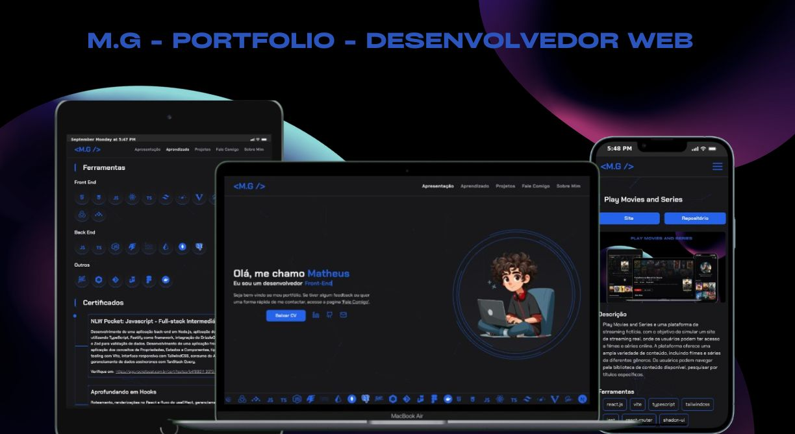

<h1 align="center">M.G - Portfolio - Desenvolvedor</h1>
<div align="center">
  <a href="#descrição">Descrição</a> |
  <a href="#iniciar">Iniciar</a> |
  <a href="#licença">Licença</a>
</div>

<p align="center">
  
</p>
<p>
 
</p>

## Descrição

A aplicação e um site que visá compartilhar, meu trabalho e meu nível, como desenvolvedor, aprestando meus projetos, minha certificações, um pouco da minha trajetória e algumas da minha habilidades atuais.

Acesse o site **[M.G - Portfolio](https://mg-developer-portfolio.vercel.app/)**.

## Iniciar

E Necessário ter o Nodejs, o git instalado e o repositório **[portfolio-back-end](https://github.com/matheus369k/portfolio-back-end)**.

Faça clone do repositório localmente.

```bash
git clone https://github.com/matheus369k/my-portfolio
cd ./my-portfolio
```

Instale as dependencies

```bash
pnpm install
```

Crie um arquivo **.env**, com as variaves ambientes abaixo

```bash
NEXT_PUBLIC_CV_LINK="http://localhost:3333/cv"
NEXT_PUBLIC_GITHUB_LINK="http://localhost:3333/github"
NEXT_PUBLIC_LINKEDIN_LINK="http://localhost:3333/linkedin"
NEXT_PUBLIC_MAIL_LINK="http://localhost:3333/mail"

NEXT_PUBLIC_BACK_END_URL="http://localhost:3333"
```

Agora você pode iniciar o projetos

```bash
pnpm dev
```

## Licença

Licença usada **[MIT](./LICENSE.txt)**
