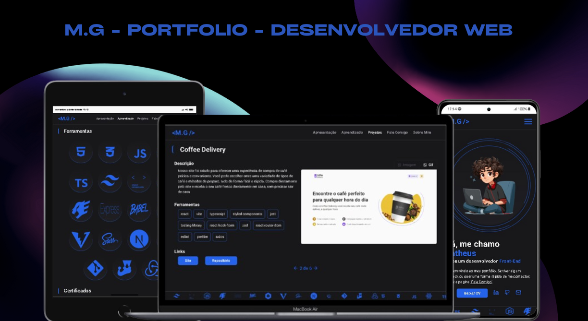

<h1 align='center' >
  💻M.G - Portfolio
</h1>

  [Ferramentas](#ferramentas)
  |
  [Projeto](#projetos)
  |
  [Licença](#licença)

  
  

  

## 🛑Atenção
Ainda esta sendo implementados os testes no projeto.

## 💻Projeto
O Site e um portfólio pessoal, onde é possível ver os projetos desenvolvidos por mim, e também me contatar. Ele visa facilitar o entendimento do que faço, e meu nível atual de conhecimento.

Acesse o site M.G - Portfólio 🔗[aqui](https://my-portfolio-ten-smoky-67.vercel.app/).

Fora criado um back-end em nodejs, para separar as responsabilidades da aplicação. Acesse o repositório 🔗[aqui](https://github.com/matheus369k/portfolio-back-end).

## 🧰Ferramentas
- Next.js 
- TailwindCSS 
- Typescript
- Context API
- Testing-library
- Hook Form
- Zod
- Jest

## 🎨Design
O design do site foi feito por mim, utilizando o Figma, e usando minha cor favorita que o o azul, como cor primaria. Meu objetivo foi criar algo simples, mas que seja atraente. que não seja muito poluído, e que seja fácil de usar. O resultado me agradou, e espero que você também goste.

Acesse o designer🔗[aqui](https://www.figma.com/design/UgZKmCI8uAagRTRkPFnShM/Portf%C3%B3lio-v2?node-id=0-1&t=nYP3hSCByUhhagK8-1).

## 📜Licença
A licença usado foi MIT, acesse 🔗[aqui](/LICENSE.txt)